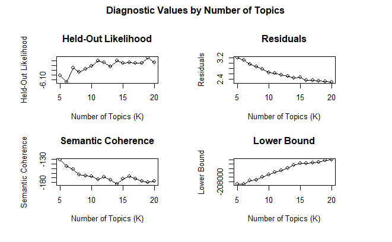

This notebook contains all analysis steps on the audio and OCR transcripts from the Moj video posts.

```{r}
library('stm')
library('lda')
library('slam')
library('dplyr')
set.seed(2024)
```

Import data-set.

```{r}
dataset <- read.csv("../../../data/files/tm_dataset.csv")
dataset.meta <- dataset %>% select("party", "party_cat", "pol_cat", "audio_lang", "has_ocr", "i")
dataset$audio_ocr_text <- paste(dataset$audio_text, dataset$ocr_text, sep=" ")
```

**First take: Audio Transcripts Only.**

Start text processing.

```{r}
custom.stop.words <- c("mein", "agar", "ji", "apne")
dataset.proc <- textProcessor(documents=dataset$audio_text,
                                meta = dataset.meta,
                                 lowercase = TRUE,
                                 removestopwords = TRUE,
                                 removenumbers = TRUE,
                                 removepunctuation = TRUE,
                                 stem = TRUE,
                                 sparselevel = 1,
                                 language = "en",
                                 verbose = TRUE,
                                 customstopwords = custom.stop.words)
```

```{r}
dataset.out <- prepDocuments(dataset.proc$documents, dataset.proc$vocab, dataset.proc$meta, lower.thresh=10)
```

Find the optimal number of topics with the searchK function. See the output plots below. We select 14 topics.

```{r}
search.k.results <- searchK(dataset.out$documents, dataset.out$vocab, K=c(5:20), data=dataset.out$meta, proportion=0.1)
plot(search.k.results)
```

```{r}
K=14
```



```{r}
audio.model <- stm(documents = dataset.out$documents, 
                     vocab = dataset.out$vocab,
                     K = 14,
                     prevalence =~ party_cat,
                     content =~ party_cat,
                     max.em.its = 75,
                     data = dataset.out$meta,
                     init.type = "Spectral",
                     verbose=FALSE)
```

```{r}
labelTopics(audio.model)
```

```{r}
plot(audio.model)
```

```{r}
# Written by ChatGPT to extract top documents per topic.
# Assuming 'stm_model' is your stm model object
# and 'theta' is the topic-document proportion matrix

# Get the theta matrix (topic proportions for each document)
theta_matrix <- audio.model$theta
# metadata <- dataset.out$meta
# Function to get the top N documents per topic
get_top_documents_per_topic <- function(theta_matrix, metadata, N = 20) {
  top_documents <- list()  # List to store top documents per topic
  
  # Loop through each topic to find the top N documents
  for (topic in 1:ncol(theta_matrix)) {
    # Get the topic proportions for the current topic
    topic_proportions <- theta_matrix[, topic]
    
    # Find the indices of the top N documents for the current topic
    top_doc_indices <- order(topic_proportions, decreasing = TRUE)[1:N]
    
    top_doc_texts <- metadata[top_doc_indices,]$i
    
    # Store the top N documents for the current topic
    top_documents[[paste("Topic", topic)]] <- top_doc_texts
  }
  
  return(top_documents)
}

# Get the top 20 documents for each topic
top_20_documents <- get_top_documents_per_topic(theta_matrix, dataset.out$meta, N = 20)

# Print the top 20 documents for each topic
# for (topic in names(top_20_documents)) {
#   cat("Top 20 Documents for", topic, ":\n")
#   print(top_20_documents[[topic]])
#   cat("\n\n")
# }
```

```{r}
all.topic.docs <- dataset %>% filter (i %in% top_20_documents[[1]]) %>% select(i,audio_text)
for (topic_num in c(2:K)){
  top_document_index <- top_20_documents[[topic_num]]
  temp.docs <- dataset %>% filter (i %in% top_document_index) %>% select(i,audio_text)
  all.topic.docs <- rbind(all.topic.docs, temp.docs)
}
all.topic.docs$topic <- rep(1:K,each=20)
write.csv(all.topic.docs,"topic_docs.csv")
```

### **Take 2: Final Analysis**

```{r}
MODEL_RUN_NUMBER = 8
```

This is repeatable code.

```{r}
fieldname <- "audio_ocr_text"
f.dataset <- dataset$audio_ocr_text
f.dataset.meta <- dataset %>% select("party", "party_cat", "pol_cat", "audio_lang", "i", "has_ocr")
custom.stop.words <- c("mein", "agar", "ji", "apne") 
K=14
```

```{r}
f.dataset.proc <- textProcessor(documents=f.dataset,
                                meta = f.dataset.meta,
                                 lowercase = TRUE,
                                 removestopwords = TRUE,
                                 removenumbers = TRUE,
                                 removepunctuation = TRUE,
                                 stem = TRUE,
                                 sparselevel = 1,
                                 language = "en",
                                 verbose = TRUE,
                                 customstopwords = custom.stop.words)
f.dataset.out <- prepDocuments(f.dataset.proc$documents, f.dataset.proc$vocab, f.dataset.proc$meta, lower.thresh=10)

```

```{r}
range(log(dataset$l))
```

```{r}
model <- stm(documents = f.dataset.out$documents, 
                     vocab = f.dataset.out$vocab,
                     K = K,
                     prevalence =~ party_cat,
                     content =~ party_cat,
                     max.em.its = 75,
                     data = f.dataset.out$meta,
                     init.type = "Spectral",
                     verbose=FALSE)
```

```{r}
labelTopics(model)
```

```{r}
plot.STM(model, type = "summary", main = "title")
proportions_table <- make.dt(model)  
summarize_all(proportions_table, mean)
summarize_all(proportions_table, sum)
```


```{r}
N_DOCS=20
theta_matrix <- model$theta
metadata <- f.dataset.out$meta
top_20_documents <- get_top_documents_per_topic(theta_matrix, metadata, N = N_DOCS)

all.topic.docs <- dataset %>% 
                    filter (i %in% top_20_documents[[1]]) %>% 
                    select(i,fieldname)

for (topic_num in c(2:K)){
  top_document_index <- top_20_documents[[topic_num]]
  temp.docs <- dataset %>% 
                filter (i %in% top_document_index) %>% 
                select(i,fieldname)
  all.topic.docs <- rbind(all.topic.docs, temp.docs)
}
all.topic.docs$topic <- rep(1:K,each=N_DOCS)

#all.topic.docs %>% write.csv(paste("topic_docs_", MODEL_RUN_NUMBER, ".csv", sep=""))

#print(paste("COMPLETED RUN NUMBER: ", MODEL_RUN_NUMBER))

#MODEL_RUN_NUMBER <- MODEL_RUN_NUMBER + 1
```

```{r}
dataset.rnums <- as.integer(names(f.dataset.out$documents))
dataset.text <- dataset$audio_text[dataset.rnums] 
findThoughts(model,texts = dataset.text, n = 20, topics = c(13))
```
]


```{r}
model.est.effect <- estimateEffect(1:K ~ pol_cat, model, meta = metadata, uncertainty = "Global")
model.est.effect <- estimateEffect(1 ~ party_cat+pol_cat, model, meta = metadata)

summary(model.est.effect, topics=13)

# model.est.effect <- estimateEffect(1:K ~ has_ocr, model, meta = metadata, uncertainty = "Global")

# plot(model.est.effect, covariate = "has_ocr", topics = c(8), model = model, method = "pointestimate",
#      main = "Effect of Text Overlay on Topic Proportion",
#      xlim = c(0, .25), labeltype = "custom",
#      custom.labels = c("Has OCR", "No Text"))

# -------------------------------------------------------------------------------------
# -----------------------------------------THIS WORKS ---------------------------------
model.est.effect <- estimateEffect(1 ~ party_cat+pol_cat, model, meta = metadata)
plot(model.est.effect, "pol_cat", model=model, method="difference", 
     cov.value1='Politicians', cov.value = 'Non-Politicians')
# -------------------------------------------------------------------------------------


# -------------------------------------------------------------------------------------
# --------------------------- ALL POLITICIAN TOPICS WORKS -----------------------------
model.est.effect <- estimateEffect(1:14 ~ party_cat+pol_cat, model, meta = metadata)
plot(model.est.effect, topics=c(1:14),"pol_cat", model=model, method="difference", 
     cov.value1='Politicians', cov.value2 = 'Non-Politicians', labeltype='custom',
     custom.labels=c(1:14))
# -------------------------------------------------------------------------------------

# -------------------------------------------------------------------------------------
# --------------------------- TESTING PARTY -----------------------------
model.est.effect <- estimateEffect(1 ~ party_cat+pol_cat, model, meta = metadata)
plot(model.est.effect,"party_cat", model=model, method="difference", 
     cov.value1='BJP', cov.value = 'AAP')
# -------------------------------------------------------------------------------------

plot(model.est.effect, covariate = "party_cat", topics = c(13), model = model, method = "pointestimate",
     main = "Effect of Party on Topic Proportion",
     xlim = c(0, .25), labeltype = "custom",
     custom.labels = c("AIMIM", "BJP", "Congress", "Samajwadi", "AAP"))

for (index in c(1:K)){
  plot(model.est.effect, covariate = "pol_cat", topics = c(index), model = model, method = "pointestimate",
     main = paste("Effect of Politicion on Topic Proportion", index, sep=" "),
     xlim = c(0, .25), labeltype = "custom",
     custom.labels = c("Politicians", "Non-Politicians"))
}
plot(model.est.effect, covariate = "party_cat", topics = c(13), model = model, method = "pointestimate",
     main = "Effect of Party on Topic Proportion",
     xlim = c(0, .25))

head(model.est.effect)

plot(model.est.effect, covariate = "pol_cat", topics = c(1), model = model, method = "difference",
     cov.value1 = "Non-Politician", cov.value2="Politician")

```
```{r}
# -------------------------------------------------------------------------------------
# --------------------------- TESTING PARTY -----------------------------
# start with new model?
model.est.effect <- estimateEffect(1 ~ party_cat+pol_cat, model, meta = metadata)
plot(model.est.effect,"party_cat", model=model, method="difference", 
     cov.value1='BJP', cov.value = 'AAP')
# -------------------------------------------------------------------------------------
```
